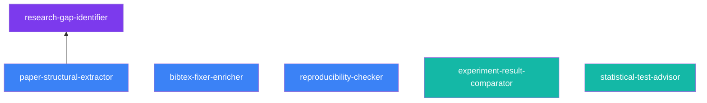

# SciSkills

**AI Agent Skills for Academic Research**

[](https://github.com/TPS-qxx/Sciskill/actions/workflows/test.yml)
[](https://python.org)
[](LICENSE)
[](https://platform.claude.com/docs/en/agents-and-tools/agent-skills/overview)

SciSkills is an open-source collection of Agent Skills for graduate researchers. Each skill is a self-contained folder with a `SKILL.md` instruction file, executable scripts, and reference docs — following the [Anthropic Agent Skills open standard](https://platform.claude.com/docs/en/agents-and-tools/agent-skills/overview).

---

## Skills

| Skill | What it does | Requires LLM? |
|-------|-------------|:---:|
| [`paper-structural-extractor`](skills/paper-structural-extractor/) | Extract structured JSON from a paper (arXiv / DOI / PDF) | Yes |
| [`bibtex-fixer-enricher`](skills/bibtex-fixer-enricher/) | Fix, normalize, and enrich BibTeX via Crossref API | No |
| [`experiment-result-comparator`](skills/experiment-result-comparator/) | Rank experiments, generate LaTeX/Markdown tables, trade-off analysis | Optional |
| [`statistical-test-advisor`](skills/statistical-test-advisor/) | Recommend + run statistical tests with Python/R code | Optional |
| [`research-gap-identifier`](skills/research-gap-identifier/) | Coverage matrix + unexplored research directions | Yes |
| [`reproducibility-checker`](skills/reproducibility-checker/) | Analyze a GitHub repo for reproducibility issues (score 0–100) | Optional |

### Dependency graph



---

## Quick Start

### 1. Install

```bash
git clone https://github.com/TPS-qxx/Sciskill.git
cd Sciskill
pip install -e ".[all]"
```

### 2. Zero-config demo (no API key needed)

`bibtex-fixer-enricher` is purely rule-based — try it immediately:

```bash
python skills/bibtex-fixer-enricher/run.py --bib examples/sample_broken.bib
```

Expected output: a JSON report listing detected issues (missing fields, inconsistent author names, duplicate entries) and the cleaned BibTeX.

### 3. Configure LLM (required for Skills 1, 3, 4, 5)

```bash
cp .env.example .env
# Edit .env and set LLM_API_KEY, LLM_BASE_URL, LLM_MODEL
```

Or export directly:

```bash
export LLM_API_KEY=your_key
export LLM_BASE_URL=https://api.openai.com/v1
export LLM_MODEL=gpt-4o
```

<details>
<summary>Tested LLM providers</summary>

| Provider | Example model | Notes |
|----------|--------------|-------|
| OpenAI | `gpt-4o` | Recommended for best extraction quality |
| Anthropic | `claude-opus-4-6` | Via OpenAI-compatible proxy |
| Doubao | `doubao-seed-1.8` | 国内推荐，速度快 |
| Any OpenAI-compatible endpoint | — | Set `LLM_BASE_URL` accordingly |

</details>

### 4. Use the CLI scripts

```bash
# Extract paper structure from arXiv
python skills/paper-structural-extractor/run.py --arxiv 1706.03762

# Fix a .bib file
python skills/bibtex-fixer-enricher/run.py --bib refs.bib

# Compare experiment results
python skills/experiment-result-comparator/run.py --input experiments.json

# Get statistical test recommendation
python skills/statistical-test-advisor/run.py --input study_design.json

# Identify research gaps from a paper collection
python skills/research-gap-identifier/run.py --input papers.json --topic "NER"

# Check a repo's reproducibility
python skills/reproducibility-checker/run.py --repo https://github.com/owner/repo
```

### 5. Unified CLI

```bash
sciskills run paper-structural-extractor --arxiv 1706.03762
sciskills run bibtex-fixer-enricher --bib refs.bib
sciskills list
```

---

## Use with Claude Code (Agent Skills standard)

Copy the `skills/` directory into your project:

```bash
# Project-level (recommended):
cp -r skills/* .claude/skills/

# Or global:
cp -r skills/* ~/.claude/skills/
```

Claude will automatically discover and use the skills when relevant to the conversation.

---

## What is an Agent Skill?

An Agent Skill is a **folder containing `SKILL.md`** — a structured instruction file that tells an AI agent *when* to use the skill and *how* to execute it, step by step. Skills are:

- **Lazily loaded**: the agent reads `SKILL.md` only when the task matches the skill's description
- **Composable**: skills can depend on each other (`research-gap-identifier` uses `paper-structural-extractor` output)
- **Framework-agnostic**: work with Claude Code, Claude API, Claude App, and any framework supporting the open standard

---

## Project Structure

```
Sciskill/
├── skills/                              ← Agent Skills (official standard)
│   ├── paper-structural-extractor/
│   │   ├── SKILL.md                     ← Agent instructions + frontmatter
│   │   └── run.py                       ← Script invoked by the agent
│   ├── bibtex-fixer-enricher/
│   │   ├── SKILL.md
│   │   ├── run.py
│   │   └── docs/issue-types.md          ← Reference, loaded on demand
│   └── ... (4 more skills)
│
├── sciskills/                           ← Python execution library
│   ├── core/                            ← BaseSkill, SkillResult, registry
│   ├── skills/                          ← Python skill implementations
│   └── utils/                           ← LLM client, API clients, LaTeX templates
│
├── examples/
│   ├── sample_broken.bib                ← Zero-dependency demo input
│   ├── standalone_usage.py
│   ├── use_with_claude.py
│   └── use_with_langchain.py
├── tests/                               ← 57 passing unit tests
└── pyproject.toml
```

---

## Python API

All skills share the same interface:

```python
import sciskills
from sciskills import registry

result = registry.get("paper_structural_extractor")({"arxiv_id": "1706.03762"})

result.success          # True / False
result.data             # structured output dict
result.errors           # list[str], non-empty only on failure
result.metadata         # elapsed_seconds, skill name, etc.

result.raise_on_error() # raises RuntimeError if not success (chainable)
```

### Experiment comparison → LaTeX table

```python
skill = registry.get("experiment_result_comparator")
result = skill({
    "experiments": [
        {"name": "BERT",       "metrics": {"F1": 88.5, "Latency_ms": 120}},
        {"name": "RoBERTa",    "metrics": {"F1": 91.2, "Latency_ms": 280}},
        {"name": "DistilBERT", "metrics": {"F1": 85.3, "Latency_ms":  65}},
    ],
    "primary_metric": "F1",
    "higher_is_better": {"F1": True, "Latency_ms": False},
    "output_format": "all",
})
print(result.data["latex_table"])   # paste into your paper
```

### Statistical test recommendation + execution

```python
skill = registry.get("statistical_test_advisor")
result = skill({
    "research_question_type": "group_comparison",
    "num_groups": 2, "variable_type": "continuous", "paired": False,
    "data": [control_scores, treatment_scores],
})
print(result.data["primary_recommendation"]["test_name"])
print(result.data["test_results"])   # {"statistic": ..., "p_value": ..., "significant": ...}
print(result.data["python_code"])    # ready-to-run scipy code
```

---

## Agent Framework Integration

### Claude Tool Use

```python
from sciskills.core.adapters import SciSkillClaudeTool
from sciskills import registry
import anthropic

adapter = SciSkillClaudeTool(registry.get("paper_structural_extractor"))
client  = anthropic.Anthropic()
response = client.messages.create(
    model="claude-opus-4-6",
    tools=[adapter.tool_definition()],
    messages=[{"role": "user", "content": "Extract arXiv:1706.03762"}],
)
```

### LangChain

```python
from sciskills.core.adapters import SciSkillLangChainTool
from sciskills import registry

lc_tool = SciSkillLangChainTool(registry.get("bibtex_fixer_enricher")).as_langchain_tool()
```

### All skills as OpenAI-compatible tools

```python
from sciskills import registry
tools = registry.to_openai_tools()
```

---

## Development

```bash
git clone https://github.com/TPS-qxx/Sciskill.git
cd Sciskill
pip install -e ".[dev,pdf,bibtex,stats]"
pytest
```

### Roadmap

- **v0.1** ✓ — Core framework + all 6 skills + official Skill folders
- **v0.2** — Async execution, skill composition helpers, PyPI release
- **v0.3** — Skill versioning, dependency declarations, evaluation harness
- **v1.0** — Stable API, full docs site

---

## Contributing

See [docs/CONTRIBUTING.md](docs/CONTRIBUTING.md). Contributions welcome — please open an issue before a large PR.

---

## License

MIT © SciSkills Contributors — see [LICENSE](LICENSE)
